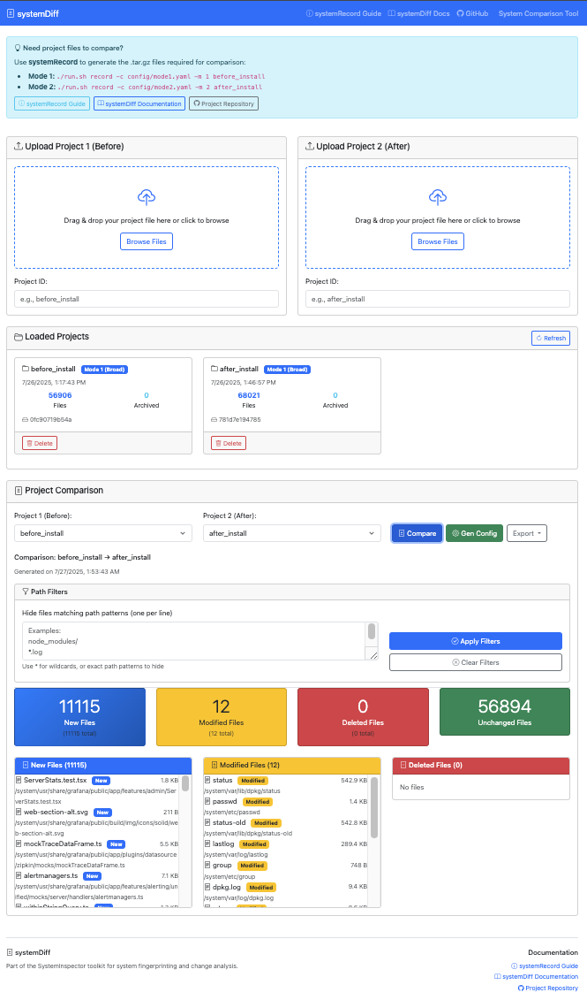

# System Inspector

A comprehensive toolkit for system fingerprinting and change analysis, consisting of two main tools:

1. **systemRecord** - System fingerprinting tool that captures system state
2. **systemDiff** - Web-based comparison tool for analyzing system changes


<!---->

## Table of Contents

- [Overview](#overview)
- [Tools](#tools)
  - [systemRecord](#systemrecord)
  - [systemDiff](#systemdiff)
- [Quick Start](#quick-start)
- [Documentation](#documentation)
- [Installation](#installation)
- [Docker Support](#docker-support)
- [Use Cases](#use-cases)
- [Contributing](#contributing)

## Overview 

System Inspector helps you track and analyze system changes by creating detailed fingerprints of your system before and after modifications (such as software installations, updates, or configuration changes). This is particularly useful for:

- Software installation impact analysis
- System compliance monitoring
- Security auditing
- Change management
- Backup verification
- Development environment tracking

## Tools

### systemRecord

A command-line tool that creates comprehensive system fingerprints with two distinct modes:

**Mode 1 - Broad Fingerprinting:**
- Scans the entire file system structure
- Records file hashes and metadata for all files (excluding ignore patterns)
- No file archiving - focuses on identifying what changed
- Ideal for initial system analysis and change detection
- Creates a comprehensive baseline of system state

**Mode 2 - Targeted Analysis:**
- Focused scanning based on known changes (typically from Mode 1 comparison)
- Archives actual file contents for detailed comparison
- Uses targeted configuration to examine specific files and directories
- Ideal for detailed analysis of specific changes

**Key Features:**
- Configuration-driven path selection
- Selective file archiving with size limits
- Comprehensive error handling and logging
- Docker support for consistent execution
- Recursive directory scanning with pattern matching

### systemDiff

A web-based application for comparing systemRecord projects:


**Key Features:**
- **Interactive Project Upload**: Drag-and-drop or browse upload for systemRecord tar files with mode recognition
- **Real-time Comparison Results**: Side-by-side system state comparison with change statistics
- **Path Filtering**: Hide unwanted files using wildcard patterns (node_modules/, *.log, etc.)
- **Detailed File Diff Viewer**: Text diff visualization with syntax highlighting
- **Mode 2 Configuration Generation**: Automatically creates targeted configs from Mode 1 comparisons
- **Change Analytics**: Comprehensive statistics and summaries of system changes
- **Export Capabilities**: Export comparison results as JSON, CSV, and YAML configs
- **Modern Responsive Interface**: Bootstrap-based UI that works on desktop and mobile

**Supported Features:**
- Project management with persistent storage
- Change categorization (new, modified, deleted files)
- File content comparison and diff visualization
- Automatic cleanup of stale projects
- Thread-safe multi-user support
- Docker containerization for easy deployment

## Quick Start

### 1. Create System Fingerprints

**Mode 1 - Initial broad analysis:**

**Using Docker (Recommended):**
```bash
cd systemRecord
# Use Mode 1 for broad system fingerprinting
./run.sh record before_install -c config/mode1.yaml -m 1
```

**Using Python directly:**
```bash
cd systemRecord
# Install dependencies
pip install -r requirements.txt

# Use Mode 1 for broad system fingerprinting
python src/main.py record before_install -c config/mode1.yaml -m 1 -o output/
```

Make your changes (install software, etc.), then capture the new state:

**Docker:**
```bash
./run.sh record after_install -c config/mode1.yaml -m 1
```

**Python:**
```bash
python src/main.py record after_install -c config/mode1.yaml -m 1 -o output/
```

**Mode 2 - Targeted analysis:**

After Mode 1 comparison, generate a targeted configuration and perform detailed analysis:

**Docker:**
```bash
# Generate Mode 2 config from Mode 1 comparison
./run.sh generate-config output/before_install.tar.gz output/after_install.tar.gz -o config/targeted.yaml

# Use Mode 2 for detailed analysis with archiving
./run.sh record before_detailed -c config/targeted.yaml -m 2
# (Make the same changes again)
./run.sh record after_detailed -c config/targeted.yaml -m 2
```

**Python:**
```bash
# Generate Mode 2 config from Mode 1 comparison
python src/main.py generate-config output/before_install.tar.gz output/after_install.tar.gz -o config/targeted.yaml

# Use Mode 2 for detailed analysis with archiving
python src/main.py record before_detailed -c config/targeted.yaml -m 2 -o output/
# (Make the same changes again)
python src/main.py record after_detailed -c config/targeted.yaml -m 2 -o output/
```

### 2. Compare Changes

**Using Docker (Recommended):**
```bash
cd systemDiff
docker-compose up --build
```

**Using Python locally:**
```bash
cd systemDiff

# Start backend
cd backend
pip install -r requirements.txt
python src/app.py &

# Start frontend (in another terminal)
cd ../frontend/public
python -m http.server 8080
```

Access the web interface at http://localhost:8080 and:

1. Upload your Mode 1 projects to see broad changes
2. Generate Mode 2 configuration directly in the web interface
3. Upload Mode 2 projects for detailed file content comparison
4. Explore file differences and export results

## Documentation

### 📚 Detailed Documentation
- **[systemRecord Documentation](systemRecord/docs/README.md)** - Complete guide for system fingerprinting
- **[systemDiff Documentation](systemDiff/docs/README.md)** - Web interface usage and API reference

### 🎯 Quick Links
- **systemRecord Features**: Configuration management, Docker usage, CLI reference
- **systemDiff Features**: Web interface guide, comparison workflows, export options
- **API Documentation**: REST endpoints for programmatic access
- **Docker Deployment**: Container setup and production deployment

## Installation

### Prerequisites

- Docker and Docker Compose (recommended)
- Or Python 3.11+ for local installation

### Using Docker (Recommended)

1. **systemRecord with Docker:**
   ```bash
   cd systemRecord
   # Use the convenience script (recommended)
   ./run.sh record PROJECT_NAME -c config/mode1.yaml -m 1
   
   # Or build and run manually
   docker build -t systemrecord .
   docker run --user $(id -u):$(id -g) \
       -v /:/system:ro \
       -v $(pwd)/config:/config:ro \
       -v $(pwd)/output:/output \
       systemrecord record PROJECT_NAME -c /config/mode1.yaml -m 1
   ```

2. **systemDiff with Docker:**
   ```bash
   cd systemDiff
   docker-compose up --build
   ```

### Local Installation

1. **systemRecord:**
   ```bash
   cd systemRecord
   pip install -r requirements.txt
   python src/main.py --help
   ```

2. **systemDiff:**
   ```bash
   # Backend
   cd systemDiff/backend
   pip install -r requirements.txt
   python src/app.py
   
   # Frontend (serve static files)
   cd ../frontend/public
   python -m http.server 8080
   ```

## Configuration

### systemRecord Configuration

Edit `systemRecord/config/default.yaml` to customize:

- **Paths to scan**: Which directories to analyze
- **Include/exclude patterns**: File filtering rules
- **Archive settings**: What files to archive and size limits
- **Logging**: Verbosity and output options

Example minimal configuration:
```yaml
paths:
  scan:
    - "/etc"
    - "/usr/local"
  include:
    - "*.conf"
    - "*.config"
archive:
  max_file_size: 104857600  # 100MB
  patterns:
    - "*.conf"
    - "*.sh"
```

### systemDiff Configuration

systemDiff uses minimal configuration - mainly API endpoint settings in the frontend JavaScript.

## Usage Examples

### Example 1: Software Installation Analysis

**Using Docker:**
```bash
# 1. Capture baseline
cd systemRecord
./run.sh record before_install -c config/mode1.yaml -m 1

# 2. Install your software
sudo apt install nginx

# 3. Capture changes  
./run.sh record after_install -c config/mode1.yaml -m 1

# 4. Compare in systemDiff web interface
cd ../systemDiff && docker-compose up
# Open http://localhost:8080 and upload both project files
```

**Using Python:**
```bash
# 1. Capture baseline
cd systemRecord
python src/main.py record before_install -c config/mode1.yaml -m 1 -o output/

# 2. Install your software
sudo apt install nginx

# 3. Capture changes  
python src/main.py record after_install -c config/mode1.yaml -m 1 -o output/

# 4. Compare in systemDiff web interface
cd ../systemDiff/backend && python src/app.py &
cd ../frontend/public && python -m http.server 8080
# Open http://localhost:8080 and upload both project files
```

### Example 2: Configuration Change Tracking

**Using Docker:**
```bash
# Focus on configuration directories - create config file
cat > config/configs_only.yaml << EOF
paths:
  scan: ["/etc", "/usr/local/etc"]
  include: ["*.conf", "*.config", "*.cfg", "*.ini"]
archive:
  patterns: ["*.conf", "*.config", "*.cfg", "*.ini"]
EOF

# Before configuration changes
./run.sh record config_before -c config/configs_only.yaml

# After making configuration changes  
./run.sh record config_after -c config/configs_only.yaml
```

**Using Python:**
```bash
# Focus on configuration directories
cat > config/configs_only.yaml << EOF
paths:
  scan: ["/etc", "/usr/local/etc"]
  include: ["*.conf", "*.config", "*.cfg", "*.ini"]
archive:
  patterns: ["*.conf", "*.config", "*.cfg", "*.ini"]
EOF

# Before configuration changes
python src/main.py record config_before -c config/configs_only.yaml -o output/

# After making configuration changes  
python src/main.py record config_after -c config/configs_only.yaml -o output/

# Compare in systemDiff
```

### Example 3: System Compliance Monitoring

**Using Docker:**
```bash
# Create compliance-focused configuration
cat > config/compliance.yaml << EOF
paths:
  scan: ["/etc", "/usr", "/var/log"]
  exclude: ["*/tmp/*", "*/cache/*"]
archive:
  max_file_size: 10485760  # 10MB
  patterns: ["*.conf", "*.log", "*.policy"]
EOF

# Regular compliance snapshots
./run.sh record compliance_$(date +%Y%m%d) -c config/compliance.yaml
```

**Using Python:**
```bash
# Create compliance-focused configuration
cat > config/compliance.yaml << EOF
paths:
  scan: ["/etc", "/usr", "/var/log"]
  exclude: ["*/tmp/*", "*/cache/*"]
archive:
  max_file_size: 10485760  # 10MB
  patterns: ["*.conf", "*.log", "*.policy"]
EOF

# Regular compliance snapshots
python src/main.py record compliance_$(date +%Y%m%d) -c config/compliance.yaml -o output/
```

## Project Structure

```
systemInspector/
├── SystemInspReq.txt           # Requirements document
├── systemRecord/               # Fingerprinting tool
│   ├── src/main.py            # Main application
│   ├── config/default.yaml   # Configuration
│   ├── tests/                 # Unit tests
│   ├── docs/README.md         # Documentation
│   ├── Dockerfile             # Container definition
│   └── run.sh                 # Convenience script
└── systemDiff/                # Comparison web app
    ├── backend/               # Flask API server
    │   ├── src/app.py        # Main API application
    │   ├── tests/            # Backend tests
    │   └── Dockerfile        # Backend container
    ├── frontend/             # Web interface
    │   ├── public/           # Static files
    │   └── Dockerfile        # Frontend container
    ├── docker-compose.yml    # Multi-service deployment
    └── docs/README.md        # Documentation
```

## Use Cases

### 🔧 **Software Installation Impact Analysis**
Track what changes when installing software packages:
```bash
# Before installation
cd systemRecord
./run.sh record before_install -c config/mode1.yaml -m 1

# Install your software
sudo apt install my-software

# After installation  
./run.sh record after_install -c config/mode1.yaml -m 1

# Compare in systemDiff to see all changes
```

### 🛡️ **Security Auditing**
Monitor system changes for security compliance:
- Track configuration file modifications
- Detect unauthorized file changes
- Monitor privilege escalations
- Audit system updates

### 📋 **Change Management**
Document and approve system changes:
- Create before/after snapshots
- Generate change reports for approval
- Track configuration drift
- Maintain compliance documentation

### 🏗️ **Development Environment Tracking**
Keep development environments consistent:
- Document environment setup procedures
- Track dependency installations
- Compare environments across teams
- Automate environment replication

### 💾 **Backup Verification**
Verify backup integrity and completeness:
- Compare system state before/after restore
- Identify missing or corrupted files
- Validate backup procedures
- Monitor backup effectiveness

## Security Considerations

- **Sensitive Files**: Configure exclusions for passwords, keys, and secrets
- **File Permissions**: systemRecord preserves permission information
- **Archive Security**: Project archives may contain sensitive configuration files
- **Access Control**: Ensure proper access controls on output files
- **Network Security**: systemDiff runs on localhost by default

## Performance Guidelines

- **Large Filesystems**: Use inclusion/exclusion patterns to limit scope
- **Memory Usage**: Tools process files individually to minimize memory usage
- **Archive Size**: Control with `max_file_size` and `patterns` settings
- **Network**: systemDiff handles file uploads up to configured limits

## Contributing

1. Fork the repository
2. Create a feature branch (`git checkout -b feature/amazing-feature`)
3. Make your changes
4. Add tests for new functionality
5. Ensure all tests pass
6. Update documentation as needed
7. Commit your changes (`git commit -m 'Add amazing feature'`)
8. Push to the branch (`git push origin feature/amazing-feature`)
9. Open a Pull Request

## Testing

Run tests for both tools:

```bash
# systemRecord tests
cd systemRecord && python -m pytest tests/

# systemDiff backend tests  
cd systemDiff/backend && python -m pytest tests/
```

## Troubleshooting

### Common Issues

1. **Permission Denied**: Run systemRecord with appropriate privileges for target directories
2. **Large Archives**: Adjust `max_file_size` or refine `include` patterns
3. **Upload Failures**: Check systemDiff file size limits and network connectivity
4. **Memory Issues**: Use more selective scanning patterns

### Getting Help

1. Check individual tool documentation in their respective `docs/` directories
2. Review configuration examples
3. Enable debug logging for detailed troubleshooting
4. Check Docker logs: `docker-compose logs`

## License

[Specify your license here]

## Support

For questions, issues, or contributions:
- Review the documentation in each tool's `docs/` directory
- Check the troubleshooting sections
- Submit issues with detailed reproduction steps
- Include relevant log files and configuration when reporting problems
