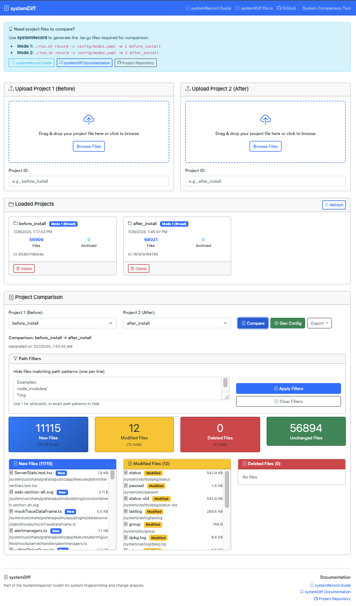

# systemDiff - System Comparison Tool



## Overview

systemDiff is a web-based tool for comparing systemRecord project files and visualizing differences between system states. It provides an intuitive interface for analyzing changes, viewing file diffs, and generating reports.

## Key Features

### 🎯 **Interactive Project Management**
- **Drag-and-drop Upload**: Simply drag systemRecord tar files into the interface
- **Mode Detection**: Automatically detects Mode 1 vs Mode 2 projects
- **Project Persistence**: Projects remain loaded across browser sessions
- **Real-time Updates**: Live project management with refresh capabilities

### 🔍 **Advanced Comparison**
- **Side-by-side Analysis**: Compare before/after system states
- **Path Filtering**: Hide unwanted files using patterns like `node_modules/`, `*.log`
- **Change Categories**: Clear visualization of new, modified, and deleted files
- **Statistics Dashboard**: Quick overview of changes with counts and summaries

### 📱 **Modern Web Interface**
- **Responsive Design**: Works on desktop, tablet, and mobile devices
- **Bootstrap UI**: Clean, professional interface with intuitive navigation
- **Real-time Feedback**: Progress indicators and status notifications
- **Thread-safe**: Supports multiple concurrent users

### 🛠 **Developer Features**
- **File Diff Viewer**: Detailed text diff visualization with syntax highlighting
- **Export Options**: Export results as JSON, CSV, or YAML configurations
- **Mode 2 Config Generation**: Automatically create targeted configurations
- **REST API**: Programmatic access to all comparison features

## Architecture

### Backend (Python/Flask)
- RESTful API for project management and comparison
- Tar file parsing and manifest analysis
- Diff generation using Python's difflib
- File content extraction and comparison

### Frontend (HTML/JavaScript)
- Bootstrap-based responsive UI
- Axios for API communication
- Chart.js for data visualization
- Monaco editor integration for diff viewing

## Installation

### Prerequisites

- Docker and Docker Compose
- Or Python 3.11+ and Node.js for local development

### Docker Installation (Recommended)

1. Navigate to the systemDiff directory:
   ```bash
   cd systemDiff
   ```

2. Build and start the services:
   ```bash
   docker-compose up --build
   ```

3. Access the application:
   - Frontend: http://localhost:8080
   - Backend API: http://localhost:5000

### Local Development

#### Backend Setup
```bash
cd backend
pip install -r requirements.txt
python src/app.py
```

#### Frontend Setup
The frontend is static HTML/JS, serve with any web server:
```bash
cd frontend/public
python -m http.server 8080
```

## Usage

### 1. Upload Projects

1. **Upload Project 1 (Before)**:
   - Drag and drop a systemRecord tar file or click to browse
   - Enter a project ID (e.g., "before_install")
   - The project will be uploaded and processed

2. **Upload Project 2 (After)**:
   - Upload the second systemRecord tar file
   - Enter a project ID (e.g., "after_install")

### 2. Compare Projects

1. Select both projects from the comparison dropdowns
2. Click "Compare" to generate the comparison
3. View the results including:
   - Statistics summary (new, modified, deleted, unchanged files)
   - Detailed file lists for each change type
   - Interactive file browser

### 3. View File Differences

1. Click on any modified file in the comparison results
2. View the detailed diff in the modal dialog
3. See line-by-line changes with syntax highlighting

### 4. Export Results

1. Use the Export dropdown to download results
2. Choose JSON for detailed data or CSV for spreadsheet analysis
3. Files are automatically downloaded with descriptive names

## API Documentation

### Endpoints

#### Health Check
```
GET /api/health
```
Returns service health status.

#### Upload Project
```
POST /api/upload
Content-Type: multipart/form-data

Fields:
- file: Project tar file
- project_id: Unique identifier for the project
```

#### List Projects
```
GET /api/projects
```
Returns list of all loaded projects with metadata.

#### Get Project Details
```
GET /api/projects/{project_id}
```
Returns detailed information about a specific project.

#### Compare Projects
```
GET /api/compare/{project1_id}/{project2_id}
```
Returns comparison results between two projects.

#### Get File Diff
```
POST /api/diff/{project1_id}/{project2_id}
Content-Type: application/json

Body:
{
  "file_path": "/path/to/file"
}
```
Returns detailed diff for a specific file.

#### Export Comparison
```
GET /api/export/{project1_id}/{project2_id}/{format}
```
Exports comparison results in specified format (json/csv).

#### Delete Project
```
DELETE /api/projects/{project_id}
```
Removes a project and cleans up resources.

### Response Format

All API responses follow this format:
```json
{
  "data": { ... },
  "error": "Error message if applicable"
}
```

## Configuration

### Backend Configuration

Environment variables:
- `PORT`: Server port (default: 5000)
- `FLASK_ENV`: Environment mode (development/production)
- `MAX_CONTENT_LENGTH`: Maximum upload size (default: 100MB)

### Frontend Configuration

Update API base URL in `js/app.js`:
```javascript
this.apiBaseUrl = 'http://your-backend-url/api';
```

## Security Considerations

- **File Upload Limits**: Configurable maximum file size
- **Input Validation**: All inputs are validated and sanitized
- **CORS Configuration**: Properly configured for cross-origin requests
- **Content Security Policy**: CSP headers for XSS protection
- **File Type Validation**: Only tar/gz files are accepted

## Performance

### Optimization Features
- **Gzip Compression**: Enabled for all text-based content
- **Caching**: Static assets cached with appropriate headers
- **Chunked Processing**: Large files processed in chunks
- **Memory Management**: Temporary files cleaned up automatically

### Scalability
- **Stateless Backend**: Can be horizontally scaled
- **Volume Storage**: Persistent storage for uploaded projects
- **Load Balancing**: Frontend can be served from CDN

## Troubleshooting

### Common Issues

1. **Upload Fails**
   - Check file size limits (default: 100MB)
   - Ensure file is a valid tar/gz format
   - Verify project ID is unique

2. **Comparison Fails**
   - Ensure both projects are fully uploaded
   - Check that project IDs exist
   - Verify projects have valid manifest files

3. **Diff Viewer Empty**
   - File may be binary (not text-based)
   - File may not be archived in the project
   - Check browser console for JavaScript errors

### Logging

Backend logs are available via Docker:
```bash
docker-compose logs backend
```

For detailed debugging, set environment:
```bash
FLASK_ENV=development
```

### Health Checks

Check service health:
```bash
# Backend
curl http://localhost:5000/api/health

# Frontend
curl http://localhost:8080/health
```

## Development

### Running Tests

Backend tests:
```bash
cd backend
python -m pytest tests/
```

### Code Structure

```
systemDiff/
├── backend/
│   ├── src/
│   │   └── app.py          # Main Flask application
│   ├── tests/
│   │   └── test_app.py     # Unit tests
│   ├── Dockerfile
│   └── requirements.txt
├── frontend/
│   ├── public/
│   │   ├── index.html      # Main HTML page
│   │   └── js/
│   │       └── app.js      # Frontend application
│   ├── Dockerfile
│   └── nginx.conf
├── docs/
│   └── README.md
└── docker-compose.yml
```

### Contributing

1. Fork the repository
2. Create a feature branch
3. Add tests for new functionality
4. Ensure all tests pass
5. Update documentation
6. Submit a pull request

## License

[Add appropriate license information]

## Support

For issues and questions:
1. Check the troubleshooting section
2. Review API documentation
3. Check Docker logs for errors
4. Submit issues with detailed reproduction steps
